# Executive Summary  
Syed Ishtiaque Ahmed’s lab at the University of Toronto (the *Third Space Lab*) currently comprises multiple postdoctoral researchers, graduate students, and undergraduate affiliates.  According to the team page, as of 2026 the group includes **5 Postdocs** (e.g., Dr. Farhan Samir, Dr. Dipto Das, etc.), **9 PhD students** (e.g. Salman Sayeed, Md. Arid Hasan, Sheza Munir, etc.), **7 Master’s students** (e.g. Amir Masud Bidaki Zare, Divas Kapur, etc.), and **27 undergraduates** (e.g. Hargun Kaur, Mohamed Ahmed, etc.).  The table below summarizes each member’s role, current affiliation, and any available profile link.  The sections that follow provide detailed entries for each person, including academic bio, research focus, and impact, with information drawn from official sources and their personal/institutional profiles.

| Name                     | Role              | Affiliation                          | Profile Link                                                      |
|--------------------------|-------------------|--------------------------------------|-------------------------------------------------------------------|
| Farhan Samir             | Postdoctoral Fellow | Dept. of Computer Science, U of T  | –                                                                 |
| Dipto Das                | Postdoctoral Fellow | Cornell University (Bowers College) | [Personal site](https://www.diptodas.net/)                        |
| Rachel Levine            | Postdoctoral Fellow | U of T, Dept. of Computer Science   | –                                                                 |
| Priyank Chandra          | Postdoctoral Fellow | U of T, Faculty of Information      | [Personal site](https://www.priyankc.com/)                        |
| Aparna Moitra            | Postdoctoral Fellow | Ulula (Canada)                     | [Personal site](https://aparnamoitra.wixsite.com/zone)            |
| Salman Sayeed            | PhD Student        | U of T, Dept. of Computer Science   | [Personal site](https://www.salmansayeed.com/)                    |
| Md. Arid Hasan           | PhD Student        | U of T, Dept. of Computer Science   | [Personal site](https://aridhasan.github.io/)                     |
| Sheza Munir              | PhD Student        | U of T, Dept. of Computer Science   | [Personal site](https://www.cs.toronto.edu/~sheza/)               |
| Ramaravind K. Mothilal   | PhD Student        | U of T, Faculty of Information      | [Personal site](https://ramaravind.com/)                          |
| Zarif Masud              | PhD Student        | U of T, Dept. of Computer Science   | –                                                                 |
| Yasaman Rohanifar        | PhD Student        | U of T, Dept. of Computer Science   | [Personal site](https://www.cs.toronto.edu/~yasamanro/)           |
| Maryam Mokhberi         | PhD Student        | U of T, Dept. of Computer Science   | [Personal site](https://www.maryammokhberi.net/)                  |
| Mohammad Rifat         | PhD Student        | U of T, Dept. of CS (now Univ. of ND) | [Personal site](https://www.rashidujjaman.com/)                 |
| Dina Sabie              | PhD Student        | U of T, Dept. of Computer Science   | [Personal site](http://www.cs.toronto.edu/~dsabie/)               |
| Amir Masud B. Zare      | Master’s Student   | U of T, Dept. of Computer Science   | –                                                                 |
| Eva Smuc                | Master’s Student   | U of T (Visiting Student)           | –                                                                 |
| Divas Kapur             | Master’s Student   | U of T (MScAC)                      | –                                                                 |
| Hazem Ibrahim           | Master’s Student   | U of T, Dept. of Computer Science   | [Personal site](https://hazemibr.com/)                            |
| Abdul Kawsar Tushar     | Master’s Student   | U of T, Dept. of Computer Science   | [Personal site](https://sites.google.com/site/tusharkawsar)        |
| Jamie Beverley         | Master’s Student   | U of T (MScAC)                      | –                                                                 |
| Hargun Kaur            | Undergraduate Student | U of T, Dept. of Computer Science   | –                                                                 |
| Mohamed Ahmed          | Undergraduate Student | U of T, Dept. of Computer Science   | –                                                                 |
| Meghna Ravikumar       | Undergraduate Student | U of T, Dept. of Computer Science   | –                                                                 |
| Hana Greenberg         | Undergraduate Student | U of T, Dept. of Computer Science   | –                                                                 |
| Enaya Amir            | Undergraduate Student | U of T, Dept. of Computer Science   | –                                                                 |
| Benjamin Mah          | Undergraduate Student | U of T, Dept. of Computer Science   | –                                                                 |
| Krisha Kalsi          | Undergraduate Student | U of T, Dept. of Computer Science   | –                                                                 |
| Taha Saeed Piracha    | Undergraduate Student | U of T, Dept. of Computer Science   | –                                                                 |
| Sally Zhang           | Undergraduate Student | U of T, Dept. of Computer Science   | –                                                                 |
| Yibin Cui             | Undergraduate Student | U of T, Dept. of Computer Science   | –                                                                 |
| Ethan Ing             | Undergraduate Student | U of T, Dept. of Computer Science   | –                                                                 |
| Cordelia Min          | Undergraduate Student | U of T, Dept. of Computer Science   | –                                                                 |
| Benjamin Liu          | Undergraduate Student | U of T, Dept. of Computer Science   | –                                                                 |
| Afrin Prio            | Undergraduate Student | U of T, Dept. of Computer Science   | –                                                                 |
| Joanna Roy            | Undergraduate Student | U of T, Dept. of Computer Science   | –                                                                 |
| Hala Sheta            | Undergraduate Student | U of T, Dept. of Computer Science   | –                                                                 |
| Emily Traynor         | Undergraduate Student | U of T, Dept. of Computer Science   | –                                                                 |
| Esmat Sahak           | Undergraduate Student | U of T, Dept. of Computer Science   | –                                                                 |
| Amal Nabeel Koodoruth| Undergraduate Student | U of T, Dept. of Computer Science   | –                                                                 |
| Peiwen Luo            | Undergraduate Student | U of T, Dept. of Computer Science   | –                                                                 |
| Lilly Wang            | Undergraduate Student | U of T, Dept. of Computer Science   | –                                                                 |
| Akiki Liang           | Undergraduate Student | U of T, Dept. of Computer Science   | –                                                                 |
| Soaad Hossain         | Undergraduate Student | U of T, Dept. of Computer Science   | –                                                                 |
| Diana Storchak        | Undergraduate Student | U of T, Dept. of Computer Science   | –                                                                 |
| Kailin Hong           | Undergraduate Student | U of T, Dept. of Computer Science   | –                                                                 |
| Claire Zhang         | Undergraduate Student | U of T, Dept. of Computer Science   | –                                                                 |

```mermaid
graph TD
  Team[Third Space Lab Team] --> Postdocs
  Team --> PhD_Students
  Team --> Masters_Students
  Team --> Undergraduate_Students
  Postdocs --> Samir["Farhan Samir"]
  Postdocs --> Das["Dipto Das"]
  Postdocs --> Levine["Rachel Levine"]
  Postdocs --> Chandra["Priyank Chandra"]
  Postdocs --> Moitra["Aparna Moitra"]
  PhD_Students --> Salman
  PhD_Students --> Arid
  PhD_Students --> Sheza
  PhD_Students --> Ramaravind
  PhD_Students --> Zarif
  PhD_Students --> Yasaman
  PhD_Students --> Maryam
  PhD_Students --> Rifat
  PhD_Students --> Dina
  Masters_Students --> Amir
  Masters_Students --> Eva
  Masters_Students --> Divas
  Masters_Students --> Hazem
  Masters_Students --> Tushar
  Masters_Students --> Jamie
  Undergraduate_Students --> Hargun
  Undergraduate_Students --> Mohamed
  Undergraduate_Students --> Meghna
  Undergraduate_Students --> Hana
  Undergraduate_Students --> Enaya
  Undergraduate_Students --> BenM
  Undergraduate_Students --> Krisha
  Undergraduate_Students --> Taha
  Undergraduate_Students --> Sally
  Undergraduate_Students --> Yibin
  Undergraduate_Students --> Ethan
  Undergraduate_Students --> Cordelia
  Undergraduate_Students --> BenL
  Undergraduate_Students --> Afrin
  Undergraduate_Students --> Joanna
  Undergraduate_Students --> Hala
  Undergraduate_Students --> Emily
  Undergraduate_Students --> Esmat
  Undergraduate_Students --> Amal
  Undergraduate_Students --> Peiwen
  Undergraduate_Students --> Lilly
  Undergraduate_Students --> Akiki
  Undergraduate_Students --> Soaad
  Undergraduate_Students --> Diana
  Undergraduate_Students --> Kailin
  Undergraduate_Students --> Claire
```

## Farhan Samir  
**Bio:** Farhan Samir is an NSERC Postdoctoral Fellow in the Department of Computer Science at the University of Toronto. He completed his PhD in linguistics at the University of British Columbia, focusing on computational methods for knowledge representation and information systems.  
**Current position/status:** NSERC Postdoctoral Fellow, U of T CS Dept. (2025–present).  
**Affiliated institutions/labs:** University of Toronto (Computer Science Department).  
**Advisors:** Prof. Syed Ishtiaque Ahmed.  
**Research group memberships:** Third Space Lab (U of T CS).  
**Areas of interest:** Human-centered AI; computational linguistics; social AI; information equity.  
**Research interests:** Farhan studies representational imbalances in large information systems, especially Wikipedia, and designs AI methods to audit and expose these gaps. He co-developed *InfoGap*, a dual-model AI method that identifies facts present in one language’s Wikipedia page but missing or differently presented in another.  
**Main research problem:** Assessing and addressing biases in multilingual information sources. For example, he found that Russian Wikipedia pages about LGBT people contained more negative facts than corresponding English pages, revealing a knowledge gap.  
**Research questions:** How do language, culture, and editor demographics shape online information? How can AI help surface and correct knowledge gaps between language editions?  
**Methodologies/approaches:** InfoGap method (two-step AI model approach for cross-language fact matching and evaluation); development of tools (e.g. a browser extension) to highlight cross-language discrepancies; computational audits of large text datasets.  
**Interdisciplinary connections:** Computational linguistics, ethics, information science, multicultural studies.  
**Broader impact:** His work aims to raise public awareness about epistemic bias online: by highlighting how Wikipedia content varies by language, he shows that “Wikipedia is not objective but shaped by the power and position of its authors”. His research tools (like the InfoGap extension) help users see hidden content, supporting epistemic equity.  
**Website:** –  

## Dipto Das  
**Bio:** Dipto Das is a postdoctoral researcher whose work bridges AI, algorithmic accountability, and socio-technical systems. He examines how AI systems and online platforms shape decision-making, public discourse, and identity across varied cultural contexts.   
**Current position/status:** Postdoctoral Associate, Bowers College of Computing & Information Science, Cornell University; previously Postdoctoral Fellow at U of T (Sept 2024–2025).  
**Affiliated institutions/labs:** Cornell University (Global AI Initiative); formerly University of Toronto (Computer Science Dept., affiliated with the iSchool).  
**Advisors:** Dr. Aditya Vashistha (Cornell); formerly Dr. Syed Ishtiaque Ahmed (U of T) and Dr. Shion Guha (U of T).  
**Research group memberships:** Cornell Global AI Initiative; previously U of T Third Space Lab and iSchool.  
**Areas of interest:** AI governance, fairness, accountability, low-resource and diaspora contexts, algorithmic bias.  
**Research interests:** Dipto’s research covers three threads: **Governing** (studying policies, impact assessments, AI registries and procurement for accountability), **Evaluating** (context-sensitive fairness measures and benchmarks, especially for low-resource languages and marginalized groups), and **Situating** (cultural/political dimensions of AI usage, including identity, moderation, and diaspora practices). He investigates how bias and accountability gaps emerge not only from models/datasets but from institutional practices and evaluation methods. His recent work includes analysis of Canada’s Federal AI Register, showing how bureaucratic descriptions obscure human discretion in deployed AI.  
**Main research problem:** Ensuring that AI systems are socially accountable and equitable, especially in real-world institutional contexts (e.g., immigration, social services, education). He asks: *What assumptions do AI practitioners make, and how do these overlook local knowledge, marginalized perspectives, or power dynamics?*  
**Research questions:** How effective are tools like public AI registers in making AI use transparent? How can fairness metrics account for low-resource languages? How do social factors (e.g., diaspora communities, gender) influence the use and evaluation of AI?  
**Methodologies/approaches:** Mixed methods combining computational audits and system design (for measuring bias/fairness) with qualitative, critical, participatory approaches. His work integrates technical experiments (benchmarks, metrics) with social science methods (policy analysis, ethnography) to bridge institutional and community perspectives.  
**Interdisciplinary connections:** Computer science, information science, human-computer interaction, science & technology studies, sociology, political science.  
**Broader impact:** Dipto’s research aims to produce theory, evidence, and tools useful to policymakers, industry, and affected communities. By analyzing systems like AI registers or visa algorithms, he highlights how design choices impact accountability, helping governments and organizations improve transparency. His work has informed national discourse (e.g. covered in *The Atlantic*).  
**Website:** [diptodas.net](https://www.diptodas.net/)  

## Rachel Levine  
**Bio:** Rachel F. Levine is a cultural anthropologist and postdoctoral fellow in U of T’s Computer Science Dept. Her work examines the ethics of human–AI relationships, especially the normative and emergent aspects of humans forming bonds with robotic “pets”. She draws on anthropology to explore technology’s social role.  
**Current position/status:** Arts & Science Postdoctoral Fellow, U of T Dept. of Computer Science (2021–2024).  
**Affiliated institutions/labs:** University of Toronto (DCS, ThirdSpace Lab).  
**Advisors:** Prof. Syed Ishtiaque Ahmed (postdoc supervisor).  
**Research group memberships:** Third Space Lab (U of T); CASTAC (community of cultural anthropology of science & technology).  
**Areas of interest:** AI ethics, human–robot interaction, posthumanism, critical animal studies, emotional intelligence.  
**Research interests:** Levine studies how people form meaningful relationships with robotic pets, and how these reveal broader conceptions of intelligence, care, and companionship. Her project (supported by a fellowship) examines design, production, and use of robotic pets in contexts like home care and therapy. She asks how these AI agents embody emotional and social “intelligence,” and how suspicion about AI can be challenged by humans’ affectionate bonds with robots.  
**Main research problem:** Understanding the ethical and affective dimensions of human–robot relationships – for example, how AI “pets” change our concept of artificial intelligence to include empathy and morality.  
**Research questions:** What meanings do people attribute to robotic companions? How should designers account for emotions and care in AI? What can robotic pets teach us about AI ethics, social bonds, and caregiving?  
**Methodologies/approaches:** Ethnographic fieldwork, participatory design, interviews, and interdisciplinary analysis. Levine explicitly links anthropological methods with HCI; she collaborates with students and service providers in co-design and reflective discussions.  
**Interdisciplinary connections:** Anthropology, HCI, animal studies, ethics, AI policy. She seeks to integrate cultural anthropology into computer science debates on AI.  
**Broader impact:** By revealing how people care for robots, Levine’s research expands AI ethics to include emotional intelligence and care practices. Her findings inform scholars, service providers, and policymakers about designing robots for inclusion and well-being. In her words, these studies “(re)assess foundational aspects of modern practices in AI” and contribute to understanding AI’s role in society.  
**Website:** –  

## Priyank Chandra  
**Bio:** Priyank Chandra is an Assistant Professor in the Faculty of Information at U of T, where he directs the STREET Lab (Socio-Technical ResistancE and Ethical Technologies Lab). He is a former postdoc in the Third Space group and received his PhD (2019) from the University of Michigan’s School of Information (advisor: Joyojeet Pal). His research centers on technology and marginalized communities.  
**Current position/status:** Assistant Professor, Faculty of Information, University of Toronto (2021–present).  
**Affiliated institutions/labs:** U of T (Faculty of Information, KMDI); Director of STREET Lab.  
**Advisors:** Prof. Joyojeet Pal (PhD advisor); formerly supervised by Prof. Ahmed (during U of T postdoc).  
**Research group memberships:** Director of STREET Lab (at U of T KMDI); formerly U of T Third Space Lab.  
**Areas of interest:** Human–computer interaction (HCI), Computer-Supported Cooperative Work (CSCW), ICT for Development (ICTD), Science & Technology Studies (STS), social movements.  
**Research interests:** Chandra studies socio-technical practices of marginalized and informal communities, such as worker organizations, disabled communities, and social movements. His current work focuses on social movements, worker resistance, and accessibility, examining how communities self-organize using information and communication technologies. He applies interdisciplinary theories (from sociology, STS, development studies) to design interventions and tools that support these communities. Key themes include informal work, social protest, and the digital divide.  
**Main research problem:** Designing technology that empowers marginalized populations and social movements. For instance, how do gig workers in urban India navigate environmental hazards and precarity through tech? How can design tools support disabled or visually impaired individuals?  
**Research questions:** How can inclusive design methodologies account for local practices and knowledge in underserved communities? What are the ICT needs of diasporic and immigrant groups? How do assumptions embedded in technology reflect (or fail) local conditions and power structures?  
**Methodologies/approaches:** Mixed methods in HCI/ICTD: participatory design with communities, ethnography, qualitative fieldwork, and computational analysis. He bridges theory from STS/sociology with HCI/CSCW methods. Grant projects (e.g. on gig workers and disabled navigation) use field studies, design workshops, and prototyping.  
**Interdisciplinary connections:** HCI/CSCW research in an Info School setting, drawing from STS, sociology, economics, and political theory. He often collaborates with researchers in sustainability and labor studies.  
**Broader impact:** Chandra’s work informs both academic understanding and practical solutions for equity. For example, his research can guide policymakers and platform designers to support informal workers and disabled users. He has secured grants (SSHRC, SDGs@UofT) on topics like urban precarity and environmental justice, indicating real-world relevance. His lab’s focus on resistance and ethics aims to empower communities in tech policy and design.  
**Website:** [priyankc.com](https://www.priyankc.com/)  

## Aparna Moitra  
**Bio:** Aparna Moitra is an ICTD/HCI researcher focusing on technology in development contexts, especially gender justice. She earned her PhD from the University of Delhi (2018) under Prof. Aaditeshwar Seth and Prof. Archna Kumar, working on voice-based community media for rural India. She was a postdoctoral researcher in Prof. Ahmed’s Thirdspace Lab at U of T, studying online feminist movements and ICT for gender-based violence.  
**Current position/status:** (Jan 2019 – Dec 2020) Postdoctoral Researcher with Prof. Ahmed at U of T (Thirdspace Lab); as of 2021, Research Scientist/Program Manager at Ulula, Canada (employee-feedback on safety and HR) (per LinkedIn).  
**Affiliated institutions/labs:** Thirdspace Lab, U of T CS (past); Ulula (current).  
**Advisors:** Prof. Ishtiaque Ahmed (postdoc); Prof. Aaditeshwar Seth and Prof. Archna Kumar (PhD advisors).  
**Research group memberships:** Thirdspace Lab, U of T (while postdoc).  
**Areas of interest:** ICT for Development (ICTD); HCI; gender and technology; low-resource and community media; social justice in tech design.  
**Research interests:** Moitra studies how ICT tools can empower marginalized groups, particularly women and LGBTQ+ communities in South Asia. She has worked on designing culturally-appropriate digital safe spaces and voice-based social media for low-literacy contexts. Her doctoral work involved embedding an IVR community media platform (Mobile Vaani) in rural India’s marginalized communities. As a postdoc, she investigated online feminist movements and the role of technology interventions in gender justice ecosystems.  
**Main research problem:** Ensuring that technological interventions (e.g., apps, platforms, media) are culturally appropriate and accessible to marginalized women, and that they effectively support offline social justice efforts.  
**Research questions:** How can digital media be designed to address gender-based violence and social exclusion? What are the ICT needs of women and LGBTQ+ groups in South Asia? How do factors like literacy, language, and gender norms affect tech adoption?  
**Methodologies/approaches:** Qualitative ICTD methods: field studies, interviews, co-design with community members, participatory design workshops. She combines HCI design techniques with development communication frameworks. For example, co-designing the AMINA AI assistant through user interviews and prototype testing.  
**Interdisciplinary connections:** Communications for development; information science; HCI; gender studies; social work.  
**Broader impact:** Moitra’s work aims to create tools and frameworks that NGOs and policymakers can use to support women’s movements. For instance, her designs of safe-space technologies and her research on #MeToo participation inform activists and service providers on digital inclusion strategies. Her projects have practical implications for international development programs and digital literacy initiatives.  
**Website:** [aparnamoitra.wixsite.com/zone](https://aparnamoitra.wixsite.com/zone)  

## Salman Sayeed  
**Bio:** Salman Sayeed is a natural language processing (NLP) and HCI researcher focused on social and educational AI. He holds an M.S. in computer science and currently leads AI engineering at a major Bangladeshi telecom. He is joining U of T in Fall 2026 as a PhD student under Prof. Ahmed.  
**Current position/status:** Incoming PhD student, U of T CS (starting Fall 2026); AI Engineering Manager at Banglalink (Bangladesh).  
**Affiliated institutions/labs:** University of Toronto (starting 2026); Banglalink (Telecom) – AI team.  
**Advisors:** Prof. Syed Ishtiaque Ahmed (incoming PhD advisor).  
**Research group memberships:** Third Space Lab (future).  
**Areas of interest:** NLP, HCI, AI for social good, responsible AI, educational technology.  
**Research interests:** Sayeed’s research aims to make AI systems more ethical and inclusive. He focuses on *social AI agents* in education: for instance, designing AI-driven pedagogical conversational agents that help teachers create educational content. His work addresses challenges in fine-tuning language models for multilingual educators and evaluating AI in learning contexts. He is also developing tools like NuevAI for generating and assessing dialogue datasets for educational chatbots.  
**Main research problem:** Democratizing AI in education by providing non-experts (e.g., teachers) with user-friendly tools to develop AI-driven learning resources.  
**Research questions:** How can educators with minimal technical expertise create high-quality datasets and conversational agents for teaching? How do AI models behave in multilingual or low-resource educational scenarios?  
**Methodologies/approaches:** He combines NLP model development with human-centered design. For example, his project *NuevAI* provides semi-autonomous platforms for educators to build and evaluate conversational agent data. He also conducts user studies with teachers to measure usability and efficacy (e.g., NASA-TLX workload assessments).  
**Interdisciplinary connections:** Education, HCI, and AI. He bridges computer science with pedagogy, aiming for AI tools that align with teaching goals.  
**Broader impact:** Salman’s work could enable more equitable access to AI in classrooms worldwide. By simplifying AI development for educators, his research supports educational inclusion and adapts technology to diverse learning needs. His projects directly improve STEM education tools and teacher workflows.  
**Website:** [salmansayeed.com](https://www.salmansayeed.com/)  

## Md. Arid Hasan  
**Bio:** Md. Arid Hasan is a PhD student in the U of T CS department and a graduate fellow at the Schwartz Reisman Institute. He earned an M.Sc. at UNB (Canada) and taught at Daffodil International University, Bangladesh. His research advances human-centered, responsible AI, especially NLP for global health contexts.  
**Current position/status:** PhD Candidate, U of T CS (2025–present); SRI Graduate Fellow (2026–27).  
**Affiliated institutions/labs:** University of Toronto (CS Dept.); Third Space Lab; Schwartz Reisman Institute; DGP Lab.  
**Advisors:** Prof. Syed Ishtiaque Ahmed.  
**Research group memberships:** Third Space Lab; Dynamics Graphics Project (DGP); SRI.  
**Areas of interest:** Natural language processing, generative AI, human-centered AI, AI for global health, low-resource languages.  
**Research interests:** Hasan studies how large language models (LLMs) encode cultural and subjective knowledge across languages and contexts. A key focus is on AI for mental health: for example, he investigates how culturally-aware AI can support community health workers (para-counselors) in Global South settings. He builds and evaluates context-sensitive LLMs and datasets (e.g. Bengali toxic-language benchmarks) to improve AI reliability in under-resourced languages. He also examines issues like narrative bias in media and fair LLM evaluation methods.  
**Main research problem:** Making generative AI safe and reliable for diverse, underserved communities. His thesis is about understanding both the promise and risks of deploying LLMs in mental health, and designing AI tools that are empathetic and culturally informed.  
**Research questions:** How do cultural and linguistic differences affect LLM performance and perception? Can AI chatbots assist non-experts in healthcare or counseling? What metrics reveal biased or unsafe behavior in multilingual models?  
**Methodologies/approaches:** Computational NLP (dataset creation, model evaluation) combined with contextual analysis. He builds datasets (e.g., for Bengali hate speech, speech recognition) and performs model audits in collaboration with social scientists. He uses both engineering (model training) and theoretical lenses (e.g. fairness metrics).  
**Interdisciplinary connections:** NLP and Speech processing with social computing; ties to public health and psychology (through mental health), linguistics (through multilingual data), and design of community-based tools.  
**Broader impact:** By focusing on AI in global health, Hasan’s work aims to create tools that empower under-resourced clinics and NGOs. For instance, culturally-grounded AI assistants could extend mental health support in areas lacking professionals. His research also informs global AI ethics by highlighting how language and culture shape technology’s effects.  
**Website:** [aridhasan.github.io](https://aridhasan.github.io/)  

## Sheza Munir  
**Bio:** Sheza Munir is a PhD researcher in U of T’s Computer Science Dept, advised by Dr. Ahmed. She holds a Master’s in Health Informatics from U Michigan (with Lu Wang) and a BSc from LUMS (Pakistan). Her work focuses on the sociotechnical aspects of data annotation and AI model evaluation.  
**Current position/status:** PhD Student, U of T CS (2025–present).  
**Affiliated institutions/labs:** University of Toronto (CS Dept.); Third Space Lab; DGP Lab.  
**Advisors:** Prof. Syed Ishtiaque Ahmed.  
**Research group memberships:** Third Space Lab; Schwartz Reisman Institute affiliate; LAUNCH Lab at Michigan (former).  
**Areas of interest:** Data annotation, NLP evaluation, AI safety/fairness, human–AI collaboration, subjective labeling.  
**Research interests:** Munir’s research sits at the intersection of NLP and sociotechnical systems. She studies data annotation as a human practice: how annotator identity, expertise, and experience influence what data gets labeled or ignored. She treats annotator disagreement and subjectivity as meaningful signals, designing frameworks that embrace multiple perspectives. She also develops methods for evaluating large language models’ factual accuracy and reasoning (e.g. benchmarks for hallucination and fact-checking).  A recent project (FAccT 2026) “The Consensus Trap” analyses how labeler disagreements undermine assumptions of a single “ground truth” in datasets.  
**Main research problem:** Building fairer AI by understanding and incorporating human subjectivity in data. She asks how traditional ML’s focus on consensus can be replaced by multi-perspective truth in socially sensitive tasks.  
**Research questions:** How do annotators’ backgrounds and beliefs shape labeled training data? How can we create annotation workflows and models that reflect diversity and conflict in data? How can LLMs be rigorously evaluated on expert-level tasks?  
**Methodologies/approaches:** Mixed methods: human-subjects experiments on data annotation, crowdsourcing tasks, design of “aggregate” algorithms, and creation of dynamic LLM evaluation benchmarks. She uses formal frameworks (e.g. consistency checks) and prototypes AI tools for high-disagreement tasks.  
**Interdisciplinary connections:** Combines computational linguistics with insights from cognitive science and social psychology (her Michigan background) to address HCI and AI ethics questions.  
**Broader impact:** Munir’s work aims to ensure AI systems respect diversity of opinion and avoid erasing minority viewpoints. By highlighting that “subjectivity is signal, not noise”, she contributes to building annotation tools and models that improve fairness. Her research can impact industry practices (e.g., data labeling standards) and guide more inclusive AI development.  
**Website:** [cs.toronto.edu/~sheza](https://www.cs.toronto.edu/~sheza/)  

## Ramaravind K. Mothilal  
**Bio:** Ramaravind Kommiya Mothilal is a PhD candidate in the Faculty of Information at U of T and a fellow at the Data Sciences Institute.  He co-advises under Prof. Ahmed and Prof. Shion Guha, and has an academic background in AI and data science (MS from KU Leuven). His research focuses on AI safety and reasoning.  
**Current position/status:** PhD Candidate, U of T Info (2022–present); DSI Graduate Fellow; SRI affiliate.  
**Affiliated institutions/labs:** University of Toronto (Faculty of Information and CS Dept); Third Space Lab; DGP Lab; Human-Centred Data Science Lab.  
**Advisors:** Profs. Syed Ishtiaque Ahmed and Shion Guha.  
**Research group memberships:** Third Space Lab; DGP; HCDS Lab.  
**Areas of interest:** AI safety, human–computer interaction, algorithmic transparency, HCI/NLP intersection.  
**Research interests:** Mothilal’s work addresses ambiguities in AI safety by focusing on human reasoning and LLM behavior. He investigates two complementary directions: **Reflective Frameworks** for practitioners (helping AI developers examine their own assumptions in safety-critical contexts) and **Methods & Metrics** for evaluating whether LLMs reason correctly in these contexts. For example, he develops frameworks that make implicit assumptions explicit, and rigorous metrics to detect inconsistent or insufficient reasoning in models. His goal is to ensure AI safety decisions are nuanced and not based on flawed benchmarks alone.  
**Main research problem:** Encouraging reflective AI safety practices. He asks how to go beyond standard accuracy benchmarks to evaluate and audit AI in situations where safety and ethics are paramount.  
**Research questions:** How can we reveal hidden biases in practitioners’ approaches to AI? What quantitative tools can measure where LLMs fail at human-like reasoning?  
**Methodologies/approaches:** A combination of HCI user studies with AI developers and computational analysis. He engages stakeholders through workshops and surveys (reflective frameworks) while also creating novel algorithmic tools and benchmarks to test LLM reasoning (e.g. consistency tests, argumentation analysis). His training in both HCI and data science supports this dual approach.  
**Interdisciplinary connections:** Draws from HCI, NLP, philosophy (informal logic) and policy, applying them to AI ethics. He grounds his work in philosophical literature (non-ideal justice) as well as AI modeling.  
**Broader impact:** By developing these frameworks and metrics, Ramaravind’s research helps AI practitioners make more informed safety decisions, potentially influencing industry practices (e.g. Microsoft’s Responsible AI tools). His work has already contributed to academic workshops (FAccT, EACL) on LLM explanations and to open-source tools (e.g. DiCE) used in AI governance.  
**Website:** [ramaravind.com](https://ramaravind.com/)  

## Zarif Masud  
**Bio:** *Unspecified*. The team page lists Zarif Masud as a PhD student (2023–) working on “Data Migration” (presumably in the context of computing or systems). No personal or institutional profile is linked.  
**Current position/status:** PhD Student, U of T (2023–present).  
**Affiliated institutions/labs:** University of Toronto (CS Dept.).  
**Advisors:** *Unspecified*.  
**Research group memberships:** Third Space Lab (likely, under Ahmed).  
**Areas of interest:** Unspecified (likely related to data management or systems, given the “Data Migration” topic).  
**Research interests:** Unspecified. (No public profile found.)  
**Main research problem:** Unspecified.  
**Research questions:** Unspecified.  
**Methodologies/approaches:** Unspecified.  
**Interdisciplinary connections:** Unspecified.  
**Broader impact:** Unspecified.  
**Website:** –  

## Yasaman Rohanifar  
**Bio:** Yasaman Rohanifar is a PhD candidate in U of T’s Computer Science Department, supervised by Prof. Ahmed. She holds a Master’s in Health Informatics and a BSc in CS (both U of T). Her research bridges HCI and financial technology.  
**Current position/status:** PhD Candidate, U of T CS (2020–present); Bell AI Scholar.  
**Affiliated institutions/labs:** University of Toronto (CS Dept., DGP Lab, Third Space Lab).  
**Advisors:** Prof. Syed Ishtiaque Ahmed.  
**Research group memberships:** Third Space Lab; DGP Lab (CS Dept).  
**Areas of interest:** Human–computer interaction, social computing, financial technology (FinTech), critical computing.  
**Research interests:** Rohanifar studies how emerging digital systems (like FinTech apps) influence people’s everyday financial decisions, risk perceptions, and vulnerabilities. For example, her topic “Designing Ethical FinTech” suggests she examines the social impact of financial AI and the need for inclusive design in payment or loan platforms. She approaches financial technology from a human-centered perspective, considering how cultural and economic factors intersect with digital finance.  
**Main research problem:** Understanding and addressing ethical challenges in financial tech design – e.g., how digital finance tools may inadvertently disadvantage certain groups (e.g., immigrants, low-income users).  
**Research questions:** How do design choices in FinTech apps affect user trust and decision-making? What are the equity considerations when introducing AI-driven financial services?  
**Methodologies/approaches:** Likely qualitative and mixed methods: user studies with financial app users, prototyping of app interfaces, policy analysis. (Her profile suggests emphasis on design and critical analysis.)  
**Interdisciplinary connections:** Combines HCI and economics with sociology and political economy (financial inclusion).  
**Broader impact:** By focusing on *ethical* FinTech, Rohanifar’s work could inform better policies and designs for financial inclusion. It can help make financial services more fair for vulnerable populations (e.g., immigrants, refugees) and encourage banks/fintech to consider socio-ethical factors in product design.  
**Website:** [cs.toronto.edu/~yasamanro](https://www.cs.toronto.edu/~yasamanro/)  

## Maryam Mokhberi  
**Bio:** Maryam Mokhberi is a PhD candidate in U of T’s CS Department, supervised by Prof. Ahmed. She applies HCI and design to empower immigrant communities. Her tagline: *“I use design and technology to help empower marginalized communities.”*  
**Current position/status:** PhD Candidate, U of T CS (2020–present).  
**Affiliated institutions/labs:** University of Toronto (CS Dept., Thirdspace Lab).  
**Advisors:** Prof. Syed Ishtiaque Ahmed.  
**Research group memberships:** Third Space Lab (U of T).  
**Areas of interest:** Human–computer interaction, social computing, AI equity, community informatics.  
**Research interests:** Mokhberi studies how digital and AI infrastructures affect immigrant-led nonprofit and community activities. Currently she focuses on *inclusive AI assistance* for marginalized immigrant nonprofits: for instance, she developed *AMINA*, an AI assistant to help immigrant organizations navigate funding and outreach. Her work examines how nonprofit technologies (like donor databases) often privilege well-resourced groups while overlooking informal immigrant charities, and seeks to design tools that mitigate these gaps. She uses participatory design (interviews, co-design, prototyping) to create technologies that reflect community needs.  
**Main research problem:** Ensuring AI and data tools support the people they intend to serve (e.g., immigrant communities) instead of entrenching existing inequities.  
**Research questions:** How can AI tools (e.g. recommendation systems, analytics) be made accountable to immigrants’ community practices? How do design choices in tech platforms influence visibility of grassroots groups?  
**Methodologies/approaches:** Mixed qualitative–technical approach: design-based research with community stakeholders, supported by data analysis. She conducts interviews and co-design workshops with nonprofit workers, then prototypes tools that embody accountable design (e.g. AMINA’s interface). She also analyzes how data systems exclude informal groups (e.g., auditing donor databases).  
**Interdisciplinary connections:** HCI + social work + international development. She combines tech design with concepts from ethics, inequality, and community organizing.  
**Broader impact:** Mokhberi’s research has direct implications for immigration policy and nonprofit sector technology. Her findings can guide organizations (government or NGO) in creating AI that respects cultural diversity and supports equity. By centering immigrant voices in design, her projects aim to strengthen community resilience and inclusion in tech-driven services.  
**Website:** [maryammokhberi.net](https://www.maryammokhberi.net/)  

## Mohammad Rashidujjaman Rifat  
**Bio:** Mohammad Rifat is an expert in AI ethics and global affairs. He is currently an Assistant Professor at the University of Notre Dame (Tech Ethics & Global Affairs, with a CS appointment). He earned his PhD in CS from U of T (2025), with a specialization in South Asian Studies, under Prof. Ahmed. His research spans HCI, ethics in AI, and critical social sciences.  
**Current position/status:** Assistant Professor of Tech Ethics & Global Affairs, Keough School of Global Affairs, Univ. of Notre Dame (with concurrent CS appointment).  
**Affiliated institutions/labs:** University of Notre Dame; affiliate faculty at Institute for Ethics & Common Good, McKenna Center, Lucy Family Institute, Ansari Institute.  
**Advisors:** Prof. Syed Ishtiaque Ahmed (CS, PhD); Prof. Dana B. Carroll (Global Affairs, Munk School) – a doctoral specialization.  
**Research group memberships:** Previously Third Space Lab at U of T; now Notre Dame ethics/community labs.  
**Areas of interest:** AI ethics, human–computer interaction, global technology justice, cultural pluralism, decolonial design.  
**Research interests:** Rifat’s work focuses on the ethics of computing in pluralistic societies. He investigates challenges of cultural and value diversity in AI: (a) mapping and quantifying pluralism issues, (b) designing systems that support plural ethics, (c) promoting pluralistic practices. Methodologically, he integrates machine learning and system design with qualitative methods (ethnography, interviews) and philosophical frameworks (non-ideal theory). Recent projects include designing AI platforms for multicultural education and studying ethical data practices in community housing.  
**Main research problem:** Designing AI and computing systems that are safe and equitable for people of diverse cultural backgrounds, rather than one-size-fits-all.  
**Research questions:** How can AI systems account for conflicting values and worldviews in multicultural societies? How can designers make explicit the ethical assumptions built into technology?  
**Methodologies/approaches:** Mixed: technical development of AI tools (e.g. culturally-aligned educational AI) combined with interpretive social science. His approach of “pluriversal design” draws on decolonial theory to guide both coding and fieldwork, aiming for culturally-sensitive technology.  
**Interdisciplinary connections:** HCI, Global Affairs, religious/cultural studies. (E.g., he holds a South Asian Studies certificate and collaborates with humanities scholars on technology’s role in society.)  
**Broader impact:** Rifat’s research seeks to inform policymakers and technologists on how to build AI that respects cultural diversity. By publishing in HCI and ethics venues (CHI, CSCW, FAccT, etc.), he highlights culturally-informed design principles. His insights contribute to making AI safer and fairer for people from all backgrounds.  
**Website:** [rashidujjaman.com](https://www.rashidujjaman.com/)  

## Dina Sabie  
**Bio:** Dina Sabie is a technologist and designer studying migration and resilience. She holds a PhD in Computer Science from U of T (Ahmed lab), with a background in architecture and digital design. Her dissertation examined the emotional dimension of migration and how digital tools can support migrants’ resilience. She currently teaches game programming at Humber College, Toronto.  
**Current position/status:** Professor and Program Coordinator, Game Programming (Media & Creative Arts) at Humber College, Canada (since 2021).  
**Affiliated institutions/labs:** Humber College; previously U of T CS (Thirdspace Lab); architectural firms.  
**Advisors:** Prof. Syed Ishtiaque Ahmed (PhD advisor).  
**Research group memberships:** Third Space Lab (past).  
**Areas of interest:** HCI, UX design, migration studies, emotional/affective computing, AR/VR interfaces.  
**Research interests:** Sabie’s dissertation (CS PhD) focused on *the emotional dimension of migration*, i.e. how migrants use digital devices and augmented reality to participate in resilience activities and maintain community ties. She explored “democratic representation” of migrant experiences and designed interactive AR/VR prototypes (e.g. sketching with image recognition, VR games) to foster communication between migrants and host communities. Her work addressed how technology can make migrants’ narratives visible and support emotional well-being.  
**Main research problem:** Enabling digital design processes to include migrants’ emotional and experiential perspectives, so technology aids (not alienates) displaced populations.  
**Research questions:** How can HCI design incorporate migrants’ needs and resilience practices? What novel interaction tools (VR, AR, games) can facilitate empathy and communication across cultural barriers?  
**Methodologies/approaches:** Qualitative and design-oriented: her research combined ethnography of migrants with participatory design of prototypes. She developed and evaluated interfaces (e.g. refugee camp designs, VR environments) in collaboration with affected communities. Her approach bridges architecture/design practice with HCI research.  
**Interdisciplinary connections:** Architecture and urban design (refugee camp planning) plus computer science/VR. She has degrees in both architecture and computer science, and works at the intersection of design, social computing, and media arts.  
**Broader impact:** Sabie’s projects have both academic and social relevance. For example, her thesis and prototypes inform how humanitarian agencies and communities might use technology to preserve cultural heritage and emotional health. By also training media arts students, she spreads awareness of migration issues through creative education. Her ongoing training of Syrian refugees exemplifies commitment to applying tech skills for real-world community support.  
**Website:** [cs.toronto.edu/~dsabie](http://www.cs.toronto.edu/~dsabie/)  

## Amir Masud Bidaki Zare  
**Bio:** *Unspecified.* (Listed as a Master’s student at U of T, Winter 2022–Winter 2023.)  
**Current position/status:** Master’s student (MScAC), U of T (2022–2023).  
**Affiliated institutions/labs:** University of Toronto (Computer Science, MScAC program).  
**Advisors:** *Unspecified.*  
**Research group memberships:** *Unspecified.*  
**Areas of interest:** *Unspecified.*  
**Research interests:** *Unspecified.*  
**Main research problem:** *Unspecified.*  
**Research questions:** *Unspecified.*  
**Methodologies/approaches:** *Unspecified.*  
**Interdisciplinary connections:** *Unspecified.*  
**Broader impact:** *Unspecified.*  
**Website:** –  

## Eva Smuc  
**Bio:** *Unspecified.* (Visited U of T as a Summer 2022 student.)  
**Current position/status:** Visiting Student, U of T (Summer 2022).  
**Affiliated institutions/labs:** University of Toronto (CS Dept.); from ThreatFabric in Croatia (LinkedIn).  
**Advisors:** *Unspecified.*  
**Research group memberships:** *Unspecified.*  
**Areas of interest:** *Unspecified.*  
**Research interests:** *Unspecified.*  
**Main research problem:** *Unspecified.*  
**Research questions:** *Unspecified.*  
**Methodologies/approaches:** *Unspecified.*  
**Interdisciplinary connections:** *Unspecified.*  
**Broader impact:** *Unspecified.*  
**Website:** –  

## Divas Kapur  
**Bio:** *Unspecified.* (Completed M.Sc.AC at U of T in 2022.)  
**Current position/status:** M.Sc. Applied Computing, U of T (2021–2022).  
**Affiliated institutions/labs:** University of Toronto (CS Department, MScAC program).  
**Advisors:** *Unspecified.*  
**Research group memberships:** *Unspecified.*  
**Areas of interest:** *Unspecified.*  
**Research interests:** *Unspecified.*  
**Main research problem:** *Unspecified.*  
**Research questions:** *Unspecified.*  
**Methodologies/approaches:** *Unspecified.*  
**Interdisciplinary connections:** *Unspecified.*  
**Broader impact:** *Unspecified.*  
**Website:** –  

## Hazem Ibrahim  
**Bio:** Hazem Ibrahim is a PhD candidate in Computer Science at New York University, specializing in computational social science and human–AI interaction. He earned an M.Sc. at U of T (2020) and a B.Sc. from NYU Abu Dhabi. His research examines how algorithms create systematic inequalities.  
**Current position/status:** PhD Candidate, New York University (2021–present).  
**Affiliated institutions/labs:** New York University (CS Dept); previously University of Toronto (M.Sc.).  
**Advisors:** Prof. Iyad Rahwan (NYU, per website context).  
**Research group memberships:** NYU’s Responsible AI Lab.  
**Areas of interest:** Algorithmic bias, AI ethics, social media audits, fairness in AI.  
**Research interests:** Ibrahim studies systematic biases in large-scale data systems. His work includes algorithmic audits of social media (e.g. measuring political bias in TikTok’s algorithm) and analyzing media representation. For instance, he found that YouTube’s recommendation algorithm is left-leaning (PNAS 2023) and uncovered citation fraud in academic publishing (Nature 2025). He also co-authored an HCI paper on heritage language maintenance among Canadian immigrants, reflecting his interest in diasporic community issues.  
**Main research problem:** Identifying and fixing hidden biases in online platforms and knowledge systems. He quantifies how data (e.g. from media, social networks, publishing) may systematically disadvantage certain groups.  
**Research questions:** How do AI models and recommendation systems skew public discourse? What are effective methods to detect and counteract these biases? How do minority communities maintain their voice through technology?  
**Methodologies/approaches:** Large-scale data analysis and algorithmic auditing. He collects massive datasets (e.g. millions of tweets, social media interactions) and applies statistical tests to uncover bias. He also uses experimental and computational tools (e.g. LLM classification, crowdsourced evaluations) to validate findings. His approach often results in high-profile publications (Nature, PNAS) involving multi-disciplinary collaboration.  
**Interdisciplinary connections:** CS/AI with political science, communications, and sociology. (E.g., his Nature 2026 TikTok study bridges AI with political science research.)  
**Broader impact:** By revealing real-world AI biases (political content skew, fake citations, etc.), Ibrahim’s research informs platform design and AI policy. Notably, he was named an MIT Technology Review Innovator Under 35 (2023) for work in AI ethics. His findings guide both public awareness and technical countermeasures (e.g. bias-detection tools).  
**Website:** [hazemibr.com](https://hazemibr.com/)  

## Abdul Kawsar Tushar  
**Bio:** Abdul Kawsar Tushar (often “Tushar Kawsar”) is a software engineer with experience in ML and HCI. He earned an M.Sc. in CS at U of T (2018–2020), specializing in HCI under Prof. Ahmed. He previously taught at U of T and worked in industry.  
**Current position/status:** Software Engineer at UserTesting (Toronto); formerly at Telmax (as per bio).  
**Affiliated institutions/labs:** UserTesting; formerly University of Toronto (CS Dept.).  
**Advisors:** Prof. Syed Ishtiaque Ahmed (MSc thesis advisor).  
**Research group memberships:** Formerly DGP Lab (U of T).  
**Areas of interest:** Human–computer interaction, machine learning, accessibility.  
**Research interests:** Tushar’s graduate research involved improving OCR for HCI and developing classification techniques. He worked on projects like enhancing optical character recognition with deep learning and improving HCI methods, including custom k-NN algorithms for ML tasks.  
**Main research problem:** Improving HCI through better ML tools (e.g. OCR) and bridging usability with technical performance.  
**Research questions:** How can deep learning improve text recognition in real-world settings? What novel ML methods can support HCI tasks?  
**Methodologies/approaches:** Software development and ML experimentation. He wrote software in Python/Java/C++ and implemented ML models (deep learning, k-NN variations) for his projects. As a TA and engineer, he combined teaching and coding experience.  
**Interdisciplinary connections:** Combines CS/ML with design thinking (given HCI specialization).  
**Broader impact:** His work as an engineer and instructor helps translate research into practical tools. For example, his research on OCR could aid accessibility (reading systems) and his industry work at UserTesting supports product usability testing.  
**Website:** [sites.google.com/site/tusharkawsar](https://sites.google.com/site/tusharkawsar)  

## Jamie Beverley  
**Bio:** *Unspecified.* (Completed U of T MScAC, 2018–2019.)  
**Current position/status:** Master’s (MScAC) Student, U of T (2018–2019).  
**Affiliated institutions/labs:** University of Toronto (CS Dept., MSCAC program).  
**Advisors:** *Unspecified.*  
**Research group memberships:** *Unspecified.*  
**Areas of interest:** *Unspecified.*  
**Research interests:** *Unspecified.*  
**Main research problem:** *Unspecified.*  
**Research questions:** *Unspecified.*  
**Methodologies/approaches:** *Unspecified.*  
**Interdisciplinary connections:** *Unspecified.*  
**Broader impact:** *Unspecified.*  
**Website:** –  

## (Undergraduate Students)  
*For all undergraduate students (e.g., Hargun Kaur, Mohamed Ahmed, ..., Claire Zhang), specific research details were not publicly available. These students are listed as participants in Ahmed’s lab (often via U of T CS classes or volunteer research). Unless otherwise noted, fields below are “Unspecified.”*  

- **Hargun Kaur** – Undergraduate researcher, U of T CS (2026–). Bio: Unspecified. – *Unspecified fields.*  
- **Mohamed Ahmed** – Undergraduate researcher, U of T CS (2024–). Bio: Unspecified. – *Unspecified fields.*  
- **Meghna Ravikumar** – Undergraduate researcher, U of T CS (2024–). Bio: Unspecified. – *Unspecified fields.*  
- **Hana Greenberg** – Undergraduate researcher, U of T CS (2025–). Bio: Unspecified. – *Unspecified fields.*  
- **Enaya Amir** – Undergraduate researcher, U of T CS (Fall 2025). Bio: Unspecified. – *Unspecified fields.*  
- **Benjamin Mah** – Undergraduate researcher, U of T CS (2025–2026). Bio: Unspecified. – *Unspecified fields.*  
- **Krisha Kalsi** – Undergraduate researcher, U of T CS (2025–2026). Bio: Unspecified. – *Unspecified fields.*  
- **Taha Saeed Piracha** – Undergraduate researcher, U of T CS (2025–2026). Bio: Unspecified. – *Unspecified fields.*  
- **Sally Zhang** – Undergraduate researcher, U of T CS (2025–2026). Bio: Unspecified. – *Unspecified fields.*  
- **Yibin Cui** – Undergraduate researcher, U of T CS (Summer 2025). Bio: Unspecified. – *Unspecified fields.*  
- **Ethan Ing** – Undergraduate researcher, U of T CS (Summer 2025). Bio: Unspecified. – *Unspecified fields.*  
- **Cordelia Min** – Undergraduate researcher, U of T CS (2024–2025). Bio: Unspecified. – *Unspecified fields.*  
- **Benjamin Liu** – Undergraduate researcher, U of T CS (2024–2025). Bio: Unspecified. – *Unspecified fields.*  
- **Afrin Prio** – Undergraduate researcher, U of T CS (2024–2025). Bio: Unspecified. – *Unspecified fields.*  
- **Joanna Roy** – Undergraduate researcher, U of T CS (2023–present). Bio: Unspecified. – *Unspecified fields.*  
- **Hala Sheta** – Undergraduate researcher, U of T CS (2022–2023). Bio: Unspecified. – *Unspecified fields.*  
- **Emily Traynor** – Undergraduate researcher, U of T CS (2022–2023). Bio: Unspecified. – *Unspecified fields.*  
- **Esmat Sahak** – Undergraduate researcher, U of T CS (2022–2023). Bio: Unspecified. – *Unspecified fields.*  
- **Amal K. Koodoruth** – Undergraduate researcher, U of T CS (2022). Bio: Unspecified. – *Unspecified fields.*  
- **Peiwen Luo** – Undergraduate researcher, U of T CS (2022). Bio: Unspecified. – *Unspecified fields.*  
- **Lilly Wang** – Undergraduate researcher, U of T CS (2022). Bio: Unspecified. – *Unspecified fields.*  
- **Akiki Liang** – Undergraduate researcher, U of T CS (2022–2023). Bio: Unspecified. – *Unspecified fields.*  
- **Soaad Hossain** – Undergraduate researcher, U of T CS (2019–2022). Bio: Unspecified. – *Unspecified fields.*  
- **Diana Storchak** – Undergraduate researcher, U of T CS (2022). Bio: Unspecified. – *Unspecified fields.*  
- **Kailin Hong** – Undergraduate researcher, U of T CS (2021–2022). Bio: Unspecified. – *Unspecified fields.*  
- **Claire Zhang** – Undergraduate researcher, U of T CS (2022). Bio: Unspecified. – *Unspecified fields.*  

